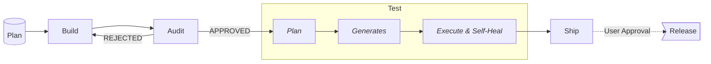

Vanilla HTML/CSS/JS landing page template powered by Vite for the OpenCode
multi-agent pipeline.  
WCAG 2.1 AA compliant, modular architecture, and zero framework lock-in.

---

## Setup

1.  **Create Repository:** Use the
    [GitHub Template](https://github.com/KiKDraS/opencode-landing-page-template/generate).
2.  **Clone & Install:**
    `git clone <your-repo> && cd <your-repo> && npm install`
    (`npm run setup` — codegraph index + Playwright browsers — runs
    automatically on first opencode load.)
    `npm install` prompts for a project name (defaults to the folder name) and
    resets the version to 0.1.0 — if it doesn't prompt (e.g. `ignore-scripts`), run `npm run init`.
3.  **Git Flow Setup:** `git checkout -b develop && git push -u origin develop`
4.  **Authenticate:** Run `opencode` then `/connect` → sign in at
    [opencode.ai/auth](https://opencode.ai/auth)
5.  **Development:** `npm run dev` → open `http://localhost:5173`

---

## Secrets & Authentication

Configure your local secrets in `.opencode/secrets/`. Files in this folder are
gitignored and read dynamically at runtime via `{file:path}`—no global
environment variables required.

| Secret / Token       | Setup Command                                       | Purpose & Notes                                                                                            |
| -------------------- | --------------------------------------------------- | ---------------------------------------------------------------------------------------------------------- |
| **Context7 API Key** | `echo "<key>" > .opencode/secrets/context7-api-key` | Optional, project-local. File ships empty + git-hidden via `npm run ignore-key` (part of setup). Enable `"enabled": true` under `"context7"` in `opencode.json`. |
| **GitHub Token**     | `echo "<token>" > .opencode/secrets/github-token`   | Required by `@release-manager` for automated PRs. _(Fallback: Git credential helper → `GITHUB_TOKEN` env)_ |

---

## AI Agent Pipeline

| Agent                       | Role                                                       | Branch Scope                              |
| --------------------------- | ---------------------------------------------------------- | ----------------------------------------- |
| `orchestrator`              | Architecture planning, task delegation, release management | Global decisions (requires user approval) |
| `frontend-dev`              | Builds features across HTML, CSS, and JS layers            | `feature/*`, `hotfix/*`                   |
| `code-review`               | Audits code quality against checklist criteria             | Reviewer authority                        |
| `release-manager`           | Manages PRs, branches, merges, tags, and releases          | Remote Git execution                      |
| `playwright-test-planner`   | Explores UI and generates test plans in `specs/`           | Testing phase                             |
| `playwright-test-generator` | Converts test plans to executable `.spec.ts` files         | Testing phase                             |
| `playwright-test-healer`    | Executes tests, debugs, and auto-fixes failures            | Testing phase                             |

### Git Flow & Agent Governance

**All AI agents are policy-bound to follow Git Flow**—no direct commits to
`main` or `develop` are allowed, and all changes must go through Pull Requests.

Autonomous agents operate within strict authority boundaries across the
workflow:

- **`@frontend-dev`** — Confined to `feature/*` and `hotfix/*` branches for
  feature implementation and bug fixes.
- **`@code-review`** — Acts as a quality gate; blocks merges until code meets
  all checklist criteria (`APPROVED`).
- **`@orchestrator`** — Decides when to advance the pipeline or request a
  release (always requires explicit user approval).
- **`@release-manager`** — Exclusively handles remote Git lifecycle operations:
  PR creation, branch merges, version tagging, and post-merge branch cleanup.

---

## Integrations & Tooling

| Tool                                                              | Purpose                                                        | Configuration                        |
| ----------------------------------------------------------------- | -------------------------------------------------------------- | ------------------------------------ |
| **[Ponytail](https://github.com/DietrichGebert/ponytail)**        | Enforces minimal code diffs, YAGNI, and stdlib-first solutions | Pre-configured (`/ponytail`)         |
| **[Caveman](https://github.com/anthonystepvoy/caveman-opencode)** | Token-efficient ultra-compressed communication mode            | Active by default (`/caveman`)       |
| **[Codegraph](https://github.com/colbymchenry/codegraph)**        | SQLite codebase indexing for surgical AI context               | Indexed via `npm run setup`          |
| **[Playwright](https://playwright.dev)**                          | Browser automation, UI exploration, and self-healing tests     | Configured in `playwright.config.ts` |
| **[Context7](https://context7.com)**                              | Live documentation fetching for modern libraries               | Optional; local key file + `enabled: true` |

---

## Troubleshooting

| Issue                                          | Solution                                                                    |
| ---------------------------------------------- | --------------------------------------------------------------------------- |
| `bad file reference: "{file:...}"`             | Only if you added a `{file:}` ref to a missing file. Shipped `{file:.opencode/secrets/context7-api-key}` is a committed empty placeholder, so it can't occur out of the box. |
| `opencode.json is not valid JSON`              | Validate syntax: `npx jsonlint opencode.json`                               |
| `browserType.launch: Executable doesn't exist` | Install browsers: `npm run setup`                                           |
| MCP server tool unavailable                    | Check `"enabled": true` in `opencode.json` and restart session              |
